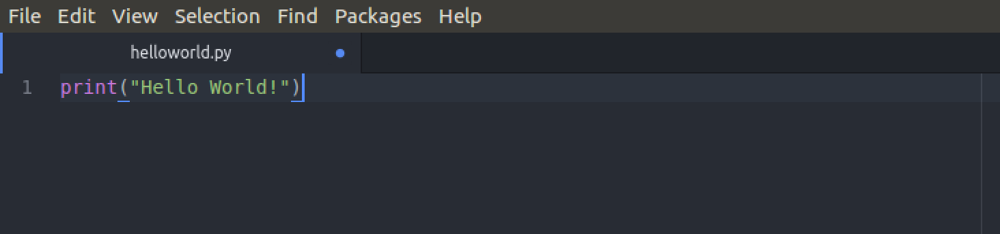

**Welcome to my Blog!**

This blog is where I'll air out ideas in my head, discuss all things tech, talk about my experience doing a placement year in an investment bank and more!

**How this blog will help you**

This blog will help you if you're also thinking of doing an internship or placement, if you want to learn a bit more about tech ranging from hosting your website using cloud technologies to automating tasks with Python

**Who am I**

My name is Nana and I'm an aspiring DevOps Engineer and also a final year student at Loughborough Univeristy studying BSc Computer Science.
