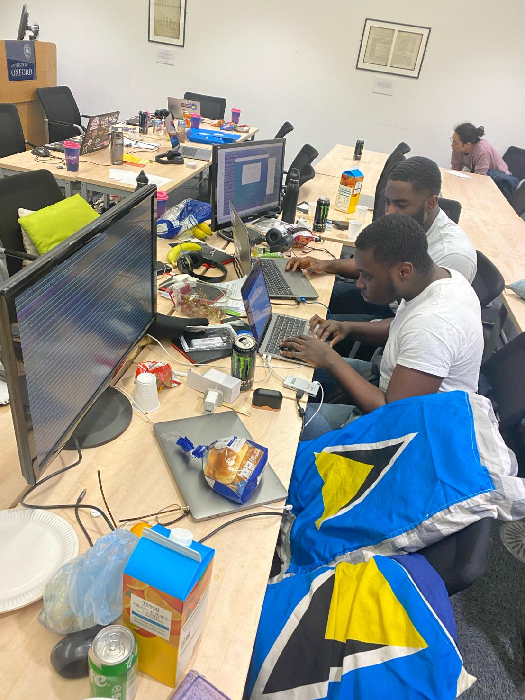
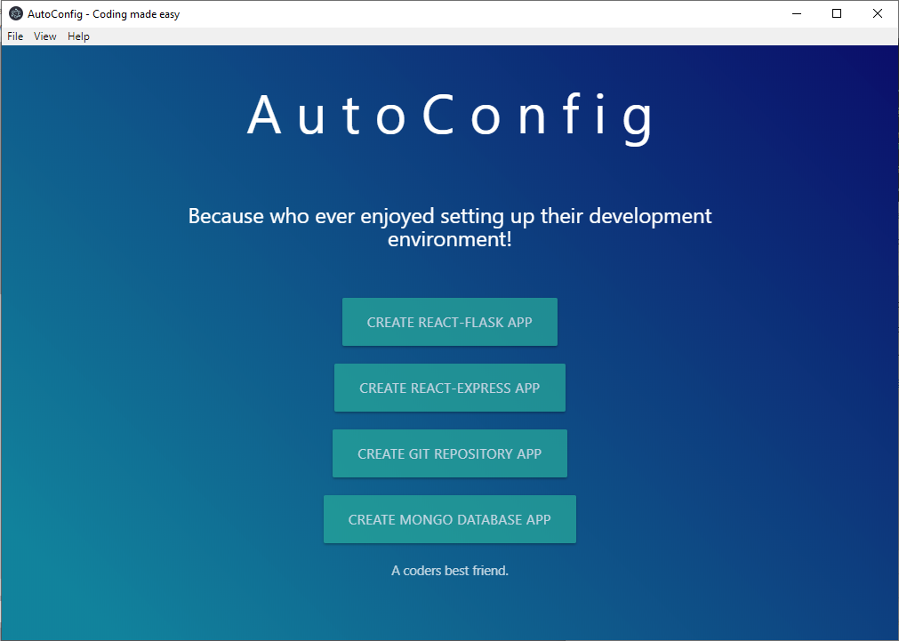

I participated in the Oxford Hack, an annual Hackathon hosted by Oxford University.

It was truly a great experience and I’ve never learnt as much in such a short time as I did in the 36 hours we had on our project.

**The Hackathon Experience**

Using technologies such as Ansible, Flask, React, Electron and Google Cloud Platform we created a tool which automatically sets up and configures full stack development environments from the click of a button or by using Alexa - from the IDE of your choice all the way to databases, web frameworks and git repositories.

It was tough and I didn’t sleep but seeing our small idea materialise into something usable at the end made it all worth it.

**How the Project looks**

We used Electron JS to create a GUI (Graphical User Interface) that can run on the desktop. We kept the user interface very plain and simple so as not to take from our applications intended functionality.

Behind this GUI we had an Ansible playbook running which automatically sets up the development environment running commands such as `shell>npx create-react-app` to install and setup the React starter boilerplate and it went as far as opening up VS Code to the newly created project.
