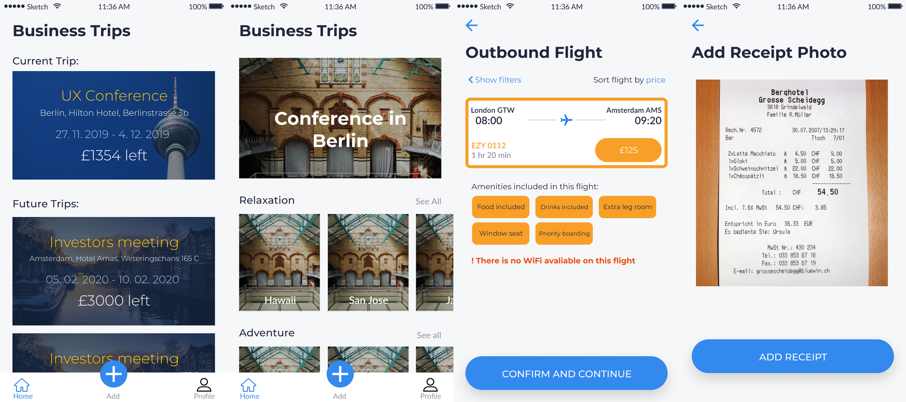

_The Hackathon that kicked off my Hackathon career._.

**Trippa - The Travel Business app**

The idea was relatively simple. An app that unifies all the current processes that are needed when employees go on business trips from finding the flight and hotel to the managing expenses and trip budgets.

Instead of having several systems to do all these things we wanted to bring them all into one place and streamline the process with features such as a receipt scanner which can automatically add and calculate expenses and a flight booker which scans the web for flights preffered by the company.

This project was a product of the BeMyApp Hacakthon which actually was the first Hackathon I attended and I came alone so had to form a team with people I've never worked with.

**Piecing it togetehr**

As we only had 24 hours we had to move quickly and be efficient. For the UI/UX we used the now very popular Figma and we chose this as it's very easy to collaborate with it since it's an online tool and it has a lot of nice designs and templates we could make use of to bring our idea to life faster.

For the backend we made use of Python and Flask to create our own custom API using various APIs provided to us by Amadeus and Here Maps.

The frontend was planned to be done using React Native but this proved difficult as the handoff from the designers to the developer (me!) was challenging as we couldn't convert the the Figma designs into usable stylesheets to be used for the front end. Being limited by time we just focussed on the API and algorthims we created and instead utilised Figmas mock app functionality to show our vision.
