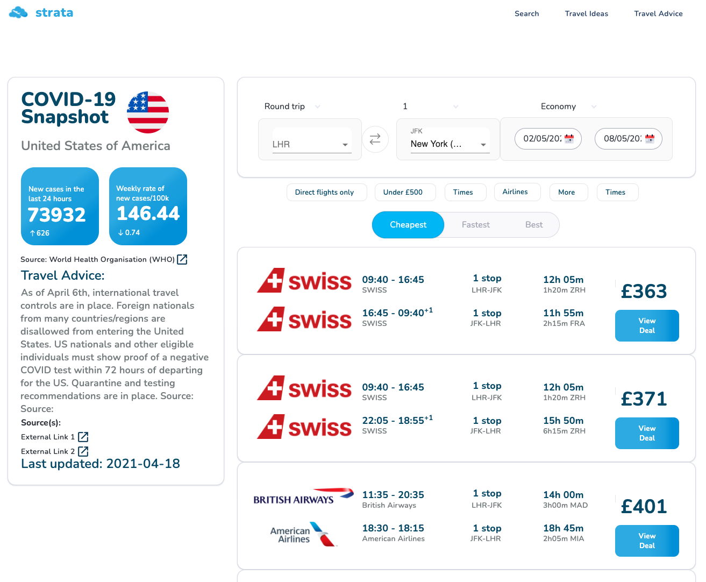

Visit project here: [Strata Flights](https://www.strataflights.co.uk)

Full Report: [Report.pdf](/files/N.Aboagye-Report.pdf)

This project brought along the development of a ‘COVID-19 aware’ flight finder web application, that itself, provides users with information and data regarding the COVID-19 situation in each country, to assist holidaymakers with the newly surfaced challenges the global pandemic has brought.

**The stack involved**

**Frontend:** React with Tailwind CSS hosted in a S3 bucket accessible via CloudFront + Route53
**Serverless Backend:** API gateway + Lambda + DynamoDB
**Lambda Function Code:** Python and JavaScript
**UI/UX Design:** Figma
...

**How the Project looks**

...
